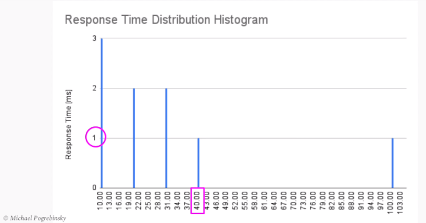
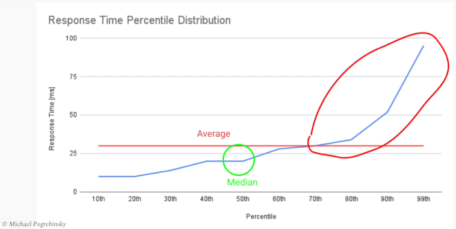

# Performance in Quality Attributes

### Performance - Response Time
+ Time between a client sending a request and receiving a response
+ Response Time(End to End Latency) = Processing Time + Waiting Time(Latency)
    - Processing Time: Time spent in our system actively process in the request and building/sending the response
    - Waiting Time(Latency): Duration of time request/response spends inactively in our system
+ Response time is an important metric(지표) when the request is in the critical path of a user interaction

### Performance - Throughput(처리량)
+ Amount of work performed by our system time(초당 업무 수행량)
    - Measured in tasks/second
+ Amount of data processed by system per unit of time(초당 데이터 처리량)
    - Measured in bits/second, Bytes/second, MBytes/second
+ ex) Distributed Logging System

### Importance Considerations
+ we should set our goal around and measure average, median, maximum, ..., response time
+ If users send two request simultaneously, one request have to wait until the first request finish, in this case the second request has bigger response time
+ We have to control the response time with our goals.

### Examples of Response Time Goals
+ 30m/s at 95th percentile of response time
+ 30m/s at 99th percentile of response time

### Measuring of Response Time
+ Use Histogram
    - 
+ Percentile
    - The "xth percentile" is the value below which x% of the values can be found
    - 
    - we have to define response time goals using percentiles
    - Measure and compare to our goals using percentile distribution
+ Tail Latency(Red circle on the picture)
    - The small percentage of response times from a system, that take the longest in comparison to the rest of values

### Performance Degradation(성능저하)
+ If the performance degradation happaned rapidly, we have to check high utilization point
+ Potential overly-utilized resources(과도하게 사용될 자원들)
    - High CPU utilization
    - High memory consumption
    - Too many connections/IO
    - Message queue is at capacity(대기열이 꽉참)

<link rel='stylesheet' href='styles.css'>