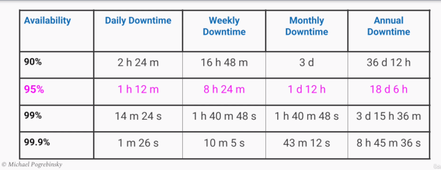

# Availability

### Importance and Risks
+ User try to purchase from online store but the page doesn't load or they get an error at checkout
+ Users lose access to their email for considerable time
+ If we provide services to other companies, the impact of outage is compounded(서비스 정지의 영향이 가중된다)
+ Our software can be used for mission-critical service like air traffic control in airport or Healthcare in hospitals and if it become unavailable for prolonged periods, people's lives are on line
+ For a business, the consequences of our system going down are if users cannot use our system, our profits become zero, if users lose access constantly, they go to our competitors
+ Thus, downtime of our system for a business results in a loss of money and customers


### Availability Definition and Formulas
```
    "The fraction of time/probability that our service is operationally functional and accessible to the user."
```
+ Uptime = Time that our system is operationally functional and accesible to the user
+ Downtime = Time that our system is unavailable to the user
+ Availability (in %) = Uptime / (Uptime + Downtime)(Entire time our system is running)

### Other Formulas
+ MTBF - Mean Time Between Failures
    - Represents the average time our system is operational(평균 가동 시간)
    - Useful when we are dealing with multiple pieces of hardware, each component has its own operational shelf life(각 컴포넌트마다 고유한 작동 수명이 있을때) and we are not using cloud/third-party API with a given uptime and availability
+ MTTR - Mean time to Recovery
    - Time average it takes us to detect and recover from a failure(장애 감지 및 복구에 걸리는 평균 시간)
    - Average downtime of our system
+ Availability = MTBF / (MTBF + MTTR)
+ This alternative formula is more statistical and talks about probabilities and also more useful for availability estimation rather than measurement
+ In practice, MTTR cannot be zero but shows that detectability and fast recovery can help us achieve high availabilty

### What is High Availability
+ 
+ There is no strict definition of what constitues high availability but the industry standard set by cloud vendors is typically 99.9% or higher
+ Percentages are referred to by the number of "nines" in their digits - 99.9% : 3 "nines" / 99.99% : 4 "nines"

<link rel='stylesheet' href='styles.css'>