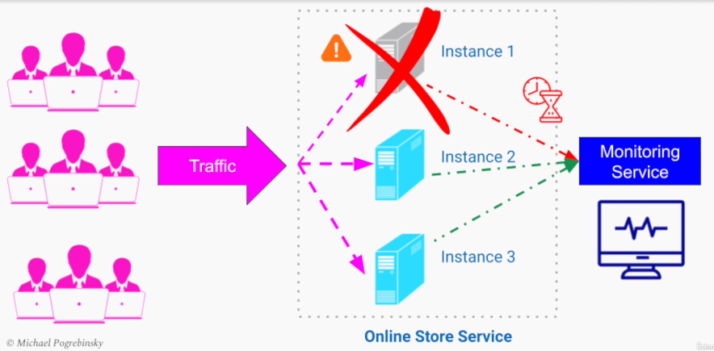

# High Availability & Fault Tolerance(고가용성과 내결함성)

### What prevents us from achieving H.A. - Sources of Failure
+ Human Error
    - Pushing a faulty config to production
    - Running the wrong command/script
    - Deploying an incompletely tested new version of software
+ Software Errors
    - Long garbage collections
    - Out-of-money exceptions
    - Null pointer exceptions
    - Segmentation faults(happens when it read wrong memory address)
+ Hardware Failures
    - Servers/routers/storage devices breaking down due to limited shelf-life
    - Power outages due to natural disasters
    - Network failures because of infrastructure issues or general congestion.(기반시설 문제 혹은 일반 혼잡으로인한 네트워크 장애)


### The Problems is
+ Failures will happen despite improvements to our code, review, testing, and release processes, performing ongoing maintenance to our hardware
+ Fault Tolerance is the best way to achieve High Availability in our system


### Methods of Achieving High Availability & Fault Tolerance
```
    "Fault Tolerance enables our system to remain operational and available to the users despite failures within one or multiple of its components".
```
+ When failures happen a fault-tolerant system will continue operating at the same/reduced level of performance as it prevents the system from becoming unavailable
+ Tactics for achieving Fault Tolerance
    - Failure Prevention
    - Failure Detection and Isolation
    - Recovery


***

# Failure Prevention
+ To prevent our entire system from going down, eliminate any Single Point of Failure in our system.
+ Examples of a Single Point of Failure can be one server where we're running our application or storing all our data on the one instance of our database that runs on a single computer
+ Best way to eliminate a single point of failure is through Replication and Redundancy(단일 장애 지점을 제거하는 가장 좋은 방법은 복제 및 중복성을 사용하는 것입니다.)
+ Type of redundancy
    - Spatial Redundancy - Running replicas of our application on different computers
    - Time Redundancy - Repeating the same operation/request multiple times until we succeed/give up
+ Two extensively used strategies for Redundancy and Replication
    - Active-Active architecture
    - Active-Passive architecture

### Advantages of Active-Active Architecture
+ Load is spread among all the replicase(복제들로 부하가 분산)
+ Identical to horizontal scalability(수평적 확장성과 일치)
+ Allow more traffic
+ Better performance

### Disadvantages of Active-Active Architecture
+ All the replicas are taking requests
+ Additional coordination required to keep active replicas in sync(활성화된 모든 복제들을 동기화하기 위한 추가적인 조정 필요)

### Advantages of Active-Passive Architecture
+ Implementation is easier
+ There is a clear leader with up-to-date data
+ Rest of the replicas are followers

### Disadvantages of Active-Passive Architecture
+ Ability to scale our system is lost(시스템 확장능력이 상실된다.)
+ All the requests still go to only one machine

***
# Failure Detection and Isolation
+ 
+ If we have a problem in one instance, detect it using Monitoring Service(if they server doesn't response for a certain amount of time it will detects the failure)
+ False Positive
    - But the issue might be the network or long garbage collection
    - Then the monitoring service is going to have a false positive
    - It assumed that a healthy host is fault
+ False Negative
    - The monitoring Service shouldn't have false negatives
    - False negative means that when the servers have crashed, the monitoring system did not detect that
+ Monitoring System Functions
    - Exchange of messages in the form of pings and heartbeats
    - Collect data about the number of errors each host gets per minute and if the error rate in one of the hosts is high, it can interpret that as failure of the host
    - Collect information about time taken for each host to respond If the time to respond to requests becomes long, it can decide that the host is slow

+ Recovery from Failure
```
    Availability = MTBF / (MTBF + MTTR)
```
+ Actions after detecting fault instance/server:
    - Stop sending traffic/workload to that host
    - Restart the host to make the problem go away
    - Rollback - going back to a version that was stable and correct
        * Common in databases
        * If we get to a state violating some condition/data, we can roll back to the last correct state in the past
        * If we detect errors while rolling out(출시하다) new version of software, we can roll back to the previous version

<link rel='stylesheet' href='styles.css'>